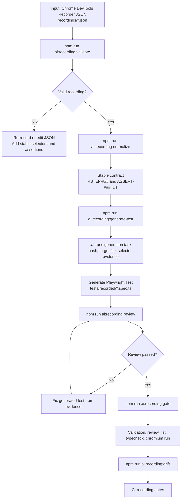

# Recording Generation Flow

This flow creates Playwright tests only from Chrome DevTools Recorder JSON exports.



## Command Path

```bash
npm run ai:recording:validate -- recordings/checkout-confirmation.json
npm run ai:recording:normalize -- recordings/checkout-confirmation.json
npm run ai:recording:generate-test -- recordings/checkout-confirmation.json
npm run ai:recording:review -- --recording recordings/checkout-confirmation.json --test tests/recorded/checkout-confirmation.spec.ts
npm run ai:recording:gate -- --recording recordings/checkout-confirmation.json --test tests/recorded/checkout-confirmation.spec.ts
npm run ai:recording:drift
```

`recordings/_example.json` is an underscore-prefixed template and is skipped by the gates (like `specs/_template.md`). The committed pair above runs against the deterministic local fixture's `/recorded-example/checkout` page in `local-chromium`.

## Enforcement

- Validation rejects malformed JSON, missing steps, unsupported step types, unsafe URLs, unsafe typed values, unusable selectors, and recordings without `waitForElement` assertions.
- Normalization assigns stable `RSTEP-###` and `ASSERT-###` IDs and derives the hash used by generated-test headers.
- Normalization drops replay metadata transparently: `setViewport`/`scroll` steps appear under `ignoredSteps` and step `assertedEvents` (navigation URL/page title) under `ignoredEvents` in the `npm run ai:recording:normalize` output, each with a reason. Both channels are excluded from the sha256 behavior hash by design; express required outcomes as `waitForElement` assertions. (Mirrors the "Ignored Recorder Metadata" section in `recordings/README.md`.)
- Review rejects stale headers, missing step/assertion coverage, missing meaningful assertions, hard waits, focused tests, XPath, `:nth-child`, unapproved CSS, Puppeteer replay code, production URLs, and secret-like literals.
- Review parity with the generated path: `test.skip`/`test.fixme`/`test.fail` are forbidden in every form including runtime calls inside test bodies; selector arguments that do not fold to a static string fail closed; positional picks (`.first()`/`.last()`/`.nth(<n>)`) require `// locator-policy:exception <reason>` on the previous line.
- String-selector action APIs are rejected by `ai:recording:review`: `page.click('css')`, `page.fill('css', value)`, `page.type`/`press`/`check`/`uncheck`/`hover`/`selectOption`/`setInputFiles` with a selector argument, `page.waitForSelector`, `page.$`/`page.$$`. Call actions on locator objects only (`page.getByRole(...).click()`); `page.keyboard.press(...)` stays allowed.
- Step fidelity: each `RSTEP` `test.step` body must perform the recorded action (navigate->`goto`, change->`fill`/`type`, click->`click`, keyDown/keyUp->`press`); the recorded change value must be passed to the in-step fill/type call (const folding understood); each `ASSERT` step must `expect()` the contract locator — same `getBy*` method, primary argument, and `name` option as the normalized recording.
- Navigate URLs are screened for secrets: suspicious query/hash parameter names (`token`, `sid`, `session`, `code`, `otp`, `key`, `auth`, `bearer`, ...) and secret-shaped values are hard validation errors. Re-record without the parameter or rename it (this also rejects benign names like `?code=DISCOUNT10`).
- The gate runs validation, review, Playwright test listing, TypeScript, and the target recorded test in Chromium.
- The gate's chromium stage writes a JSON report (`PLAYWRIGHT_JSON_OUTPUT_NAME=.ai-runs/recording-gate-last-run.json`) and fails unless `expected>=1`, `unexpected=0`, `skipped=0`. A flaky run fails too: a test that passed only after a retry is a deterministic-test failure.
- Recorder selector normalization prefers meaningful stable `data-testid` selectors before role/name, stable text, and raw CSS fallbacks.
