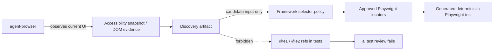
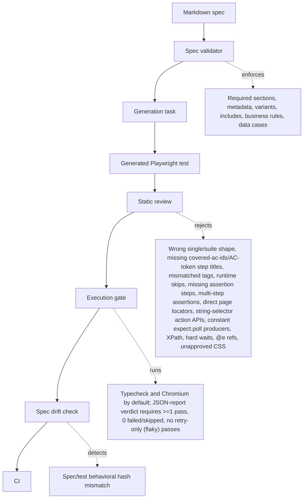

# Test Generation Flow

This diagram shows the current AI-assisted Playwright test generation flow.

```mermaid
flowchart TD
  A["Input: raw manual case, checklist, Gherkin, or human-written spec"] --> B{"Is it already a strict Markdown spec?"}

  B -- "No" --> C["npm run ai:spec:import<br/>Create ai-draft spec"]
  C --> D["Human review<br/>Resolve NEEDS_REVIEW<br/>Promote to human-reviewed"]
  D --> E["Strict Markdown spec<br/>specs/*.md"]

  B -- "Yes" --> E

  E --> F["npm run ai:spec:validate<br/>Validate spec contract"]
  F --> G{"Need current UI DOM/accessibility evidence?"}

  G -- "Yes" --> H["npm run ai:dom:discover<br/>agent-browser opens target URL"]
  H --> I["agent-browser snapshot -i --json<br/>Collect roles, names, labels, text, placeholders"]
  I --> J["Framework selector policy scores candidates<br/>No @e refs persisted as selectors"]
  J --> K["selector-candidates.json<br/>Ignored artifact under .ai-runs/"]
  K --> L["npm run ai:dom:discover:review<br/>Reject @e refs, XPath, nth-child, raw CSS candidates"]

  G -- "No" --> M["No discovery artifact"]
  L --> N["npm run ai:generate-test"]
  M --> N

  N --> O["Generation task created<br/>.ai-runs/&lt;run&gt;/generation-task.md"]
  O --> P["Task includes:<br/>spec path, version, hash, generation mode,<br/>AC IDs, target test file, optional DOM artifact"]
  P --> Q["Codex generates or updates Playwright test"]

  Q --> R["Reuse existing framework pieces<br/>fixtures, Page Objects, components, helpers, test data"]
  R --> S["Generated test implementation<br/>tests/**/*.spec.ts"]

  S --> T["Required generated test properties:<br/>spec header, test.step, POM-owned locators,<br/>single-test default, final assertion steps, data cases, mocks"]
  T --> U["npm run ai:test:review<br/>Static AST review"]

  U --> V{"Review passed?"}
  V -- "No" --> W["Fix generated code only from verified issues<br/>Do not remove assertions to force pass"]
  W --> U

  V -- "Yes" --> X["npm run ai:test:gate"]
  X --> Y["Gate runs:<br/>spec validation, static review,<br/>test listing, typecheck, Playwright execution"]

  Y --> Z{"Gate passed?"}
  Z -- "No" --> AA["Collect evidence<br/>reports, traces, test-results copied under .ai-runs/&lt;run&gt;/evidence"]
  AA --> W

  Z -- "Yes" --> AB["npm run ai:spec:drift<br/>Verify test header hash matches spec"]
  AB --> AC["Generated test accepted locally"]
  AC --> AD["CI quality gates<br/>self-tests, spec validation, drift, gate-all, smoke, accessibility"]
```



## Selector Ownership



Locator priority inside Page Objects/Component Objects is: `this.page.getByTestId(...)` for meaningful stable `data-testid`, `this.page.getByRole(...)` with accessible name, `this.page.getByLabel(...)`, `this.page.getByPlaceholder(...)`, `this.page.getByText(...)` for stable visible copy, then raw CSS only with `// locator-policy:exception <reason>`.

Default generation mode is single-test mode. Generate a suite only when the spec declares `Generation Mode | suite` or a suite is explicitly requested. Generated tests must verify one clear outcome per test. Action/setup steps may navigate and interact with the UI, but `expect(...)` belongs only in the final `Assert AC-###` or `Assert NEG-###` step.

## Gate Responsibility



## Current Command Path

For a reviewed spec with optional DOM discovery:

```bash
npm run ai:spec:validate -- specs/example-flow.md
npm run ai:dom:discover -- --spec specs/example-flow.md --url http://localhost:3000/ai-example/checkout
npm run ai:dom:discover:review -- --spec specs/example-flow.md
npm run ai:generate-test -- specs/example-flow.md --target tests/regression/example-flow.spec.ts
npm run ai:test:review -- --spec specs/example-flow.md --test tests/regression/example-flow.spec.ts
npm run ai:test:gate -- --spec specs/example-flow.md --test tests/regression/example-flow.spec.ts
npm run ai:spec:drift
```

No `--mode` flag is needed: review and gate resolve the mode from the spec's optional `Generation Mode` Metadata row (default `single`), and a contradicting `--mode` flag is a hard error. Start the demo app with `npm run demo:start` before running discovery against `http://localhost:3000`.

Default generated-test execution target is Chromium only. Cross-browser generated-test execution is opt-in with `--all-projects` or an explicit `--projects` list. The gate runs Playwright with `--reporter=html,json` and fails unless the JSON report shows >=1 passing and 0 failed/skipped tests for the target file. A flaky run also fails the gate: a test that passed only after a retry is a deterministic-test failure.

Generated tests must perform actions through locator objects owned by Page Objects/Component Objects — string-selector action APIs such as `page.click('css...')` or `page.fill('css...', value)` are forbidden outright. Tautological `expect.poll(...)` assertions are rejected even when the producer is spread across multiple statements that fold to a constant.

For raw manual input:

```bash
npm run ai:spec:import -- --input docs/manual/<case>.md --out specs/<flow>.draft.md
# Human review promotes the draft
npm run ai:spec:validate -- specs/<flow>.md
npm run ai:generate-test -- specs/<flow>.md
```
