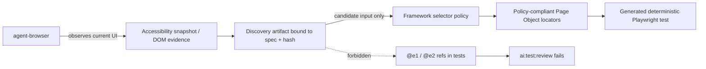
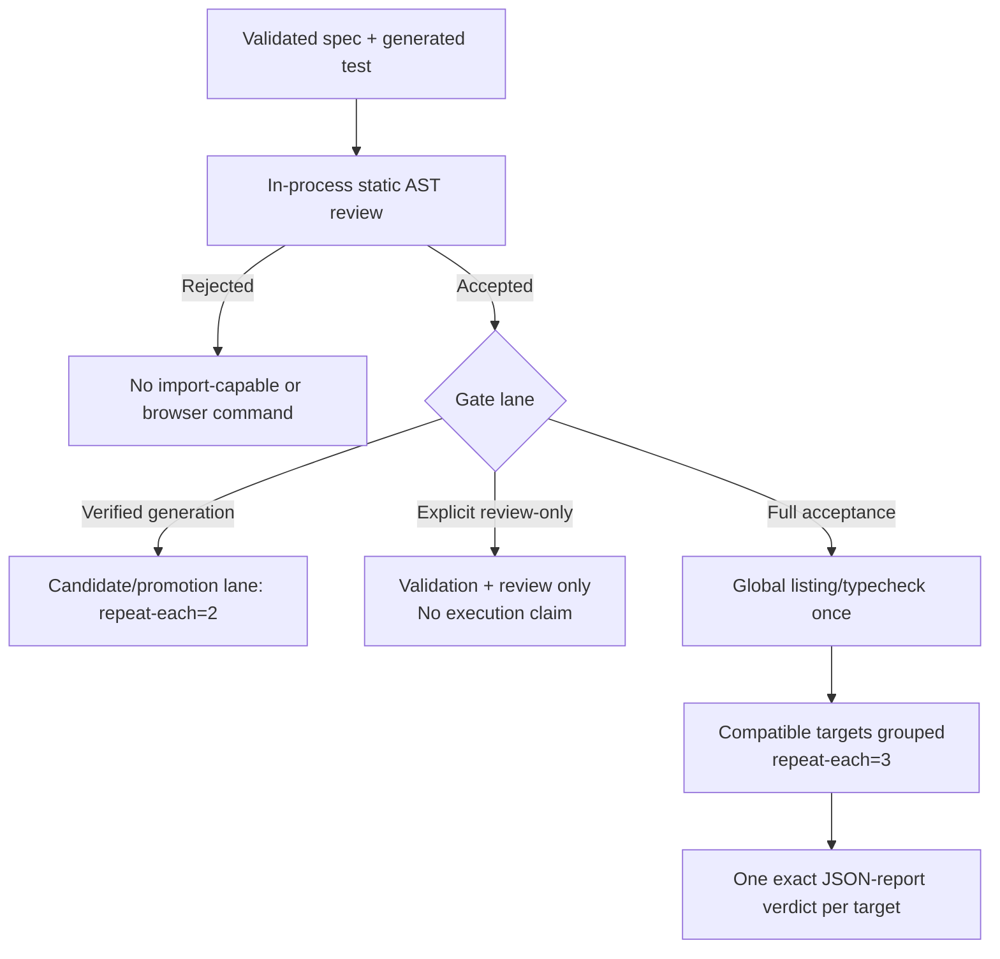

# Test Generation Flow

The current path keeps flow fitting, Playwright generation, and acceptance as separate contracts. Provider output never becomes an accepted test merely because it is well-formed.

```mermaid
flowchart TD
  A["Input: manual case, checklist, Gherkin, rough notes, or strict flow spec"] --> B{"Already a strict Markdown flow spec?"}

  B -- "No: deterministic import" --> C["npm run ai:spec:import<br/>Create a draft spec"]
  B -- "No: AI fit" --> D["Secret and size precheck<br/>Rules + untrusted source; no template bytes"]
  D --> E["Provider returns semantic<br/>flow-spec-draft/v2 JSON"]
  E --> F["Application renders canonical Markdown<br/>and validates the draft contract"]
  C --> G["Draft Markdown spec"]
  F --> G
  G --> H["Resolve exact NEEDS_REVIEW values<br/>Supply deterministic contract data"]
  B -- "Yes" --> I["Strict Markdown spec<br/>specs/*.md"]
  H --> I

  I --> J["npm run ai:spec:validate<br/>Validate structure, paths, IDs, tables, and JSON"]
  J --> K{"Need current UI DOM/accessibility evidence?"}
  K -- "Yes" --> L["npm run ai:dom:discover<br/>Capture bounded candidate evidence"]
  L --> M["npm run ai:dom:discover:review<br/>Bind artifact to spec path + hash"]
  K -- "No" --> N["Explicitly no DOM artifact"]

  M --> O["npm run ai:generate-test"]
  N --> O
  O --> P["generation-task.md for humans<br/>provider-input.md for the brain<br/>manifest.json binds both"]
  P --> Q["npm run ai:brain:generate"]
  Q --> R["Input assembly + subject binding"]
  R --> S["Readiness preflight<br/>No browser launch and no provider attempt"]
  S --> T["Rebuild and verify canonical input<br/>Reject spec/task/target/mode/policy/context drift"]
  T --> U{"Accepted exact cache reusable?<br/>REST/Codex + verified target state"}
  U -- "No or disabled" --> V["Selected brain returns candidate output"]
  U -- "Yes" --> W["Load exact accepted source"]
  V --> X["Write isolated candidate"]
  W --> X
  X --> Y["Two-repeat promotion gate<br/>One Playwright command; retries=0"]
  Y -- "Rejected" --> Z["Archive candidate; invalidate a hit reference<br/>Leave target unchanged"]
  Y -- "Accepted" --> AA["Atomically promote target<br/>Retain/promote exact cache reference<br/>Finalize generation run ID"]
  AA --> AB["Three-repeat full gate<br/>Optionally link exact run ID + subject"]
  AB --> AC["npm run ai:spec:drift"]
  AC --> AD["CI quality gates"]
```



## Semantic flow fitting

The AI fit request contains concise rules, the `flow-spec-draft/v2` schema identity, and the credential/token-shape-checked source as explicitly untrusted data. Ordinary security prose and supported identifiers remain valid input. The request does not contain bytes from `specs/_template.md`; the separate template endpoint remains available for humans.

REST, Claude CLI, and Codex CLI fit routes must return the same semantic object. Provider Markdown is rejected. The application alone:

- fixes Markdown section and table order;
- escapes human table content and renders canonical fenced JSON;
- projects the single semantic `dataCases` collection into both `Data Cases` and `Data Cases as JSON`;
- inserts the canonical locator and generated-test policies;
- owns reserved generation metadata and deterministic draft defaults;
- validates the rendered text before the fit result is trusted or returned.

An exact, case-sensitive `NEEDS_REVIEW` value is permitted only during draft validation. It does not waive required metadata, table shape, IDs, JSON validity, target scope, `.spec.ts` suffixes, or concrete auth routing. Normal validation rejects unresolved sentinels.

Flow fitting is not part of the accepted Playwright exact-result cache. Its run ID identifies fit telemetry only and is never linked to a generated-test gate.

## Provider-free Playwright preflight

`ai:brain:generate` uses verified generation. For a flow source, it records a `preflight` stage and rejects before any REST request or CLI brain process when readiness fails. The preflight uses the resolved environment supplied to the run rather than ambient fallback and does not launch a browser.

It checks:

- the source still validates as a flow spec;
- project routing is valid, including `E2E_AUTH_ENABLED=true` for an auth-required spec;
- Playwright's Chromium path is a regular, non-symlink executable file when a browser project is selected;
- every selected external project's `PLAYWRIGHT_TEST_BASE_URL` satisfies the same target contract as Playwright configuration: HTTPS, no embedded credentials, no non-standard port, query, or fragment, and either an explicit non-production hostname label or an exact reviewed hostname in `E2E_AUTH_ALLOWED_HOSTS`; malformed/wildcard allowlist entries are rejected (`local-chromium` does not require an external URL);
- reusable auth state is an existing regular non-symlink file when `E2E_AUTH_REUSE_STATE=true`;
- otherwise, auth-required generation has `E2E_USER_EMAIL`, `E2E_USER_PASSWORD`, and either `E2E_AUTH_SUCCESS_SELECTOR` or `E2E_AUTH_SUCCESS_URL_REGEX`.

Failure records no provider attempt, never replaces the requested target, and finalizes the generation run as failed at preflight.

## Bound provider input and context

`npm run ai:generate-test` creates three sibling artifacts:

- `generation-task.md`: the deterministic human-readable implementation task;
- `provider-input.md`: the canonical generation IR plus one rendered context pack; this is the only flow-task payload sent to REST or CLI brains;
- `manifest.json`: byte counts, SHA-256 values, source/target/mode/policy identities, and generation/context fingerprints.

Before provider dispatch, saved-task generation verifies both artifact bytes and hashes, rebuilds the current canonical input, and compares the spec, target, mode, policy, IR, and context. Direct `--spec` generation builds the same canonical provider input.

The ordinary context pack is capped at the exact 3,500 characters rendered into provider input. It includes only bounded, redacted facts from reviewed DOM evidence, fixtures, positively relevant Page Objects, and the existing target's digest/imports/top-level signatures. It excludes target bodies, raw DOM bodies, arbitrary methods, URL credentials/query/fragment data, and secret-like strings. The mutable target hash is a reuse precondition, not part of the semantic cache key.

Accepted exact-result reuse is available for REST Playwright providers and Codex CLI. The target state is tri-state: digest = known present, `null` = proven missing, omitted = unknown. Unknown disables cache read/write candidacy and exact single-flight joining. A stored result is reusable only when the current target matches its cached input state or its verified output digest. See [Token Economy and Generation Telemetry](TOKEN_ECONOMY.md) for the full cache and accounting contract.

## Selector ownership



Locator priority inside Page Objects/Component Objects is `this.page.getByTestId(...)` for a meaningful stable `data-testid`, then `this.page.getByRole(...)` with accessible name, `this.page.getByLabel(...)`, `this.page.getByPlaceholder(...)`, and `this.page.getByText(...)` for stable visible copy. Raw CSS requires `// locator-policy:exception <reason>` on the previous line.

Generated test bodies must act through locator objects owned by Page Objects/Component Objects. Direct test-body `page.getBy*`/`page.locator(...)` creation and selector-string APIs such as `page.click('css...')` or `page.fill('css...', value)` are forbidden.

Default generation mode is `single`. Generate a suite only when the spec declares `Generation Mode | suite` or the caller explicitly requests the matching mode. A contradicting `--mode` is a hard error. Generated tests verify one clear outcome per test, and `expect(...)` belongs only in the final `Assert AC-###: ...` or `Assert NEG-###: ...` step.

## Fast, review-only, and full gates



- Verified generation always runs one Playwright command with `--repeat-each=2 --retries=0` against the isolated candidate. Every logical execution must pass before the target is atomically replaced and the exact-result cache entry is accepted/promoted.
- `npm run ai:test:review:all` validates the directory once and reviews every applicable pair in process. It runs no global listing, typecheck, or Playwright command and explicitly makes no execution claim.
- `npm run ai:test:gate:all` reviews all selected pairs before import-capable work, performs shared listing/typecheck once, and groups compatible targets by project, runtime profile, repeat count, and normalized project environment.
- Every full group uses one `--repeat-each=3 --retries=0` Playwright command. A shared report is traversed once but produces an independent exact-path verdict for every requested target. The bounded regular-file report must contain the official envelope, one exact requested project configuration with the requested repeat/retry values, matching project name/ID on every target result, and the requested repeat multiplicity for every logical target test. A counted pass also requires `expectedStatus: passed` and one successful retry-0 result, so an intentional `test.fail` outcome cannot masquerade as a passing execution.
- Top-level Playwright setup/teardown/configuration errors and abnormal process exits fail every lane in the group as runtime-environment failures without copying raw error text. A normal exit 0 or 1 with report-proven failure, skip, flaky retry, or missing target coverage remains a runtime-test quality rejection. One target's ordinary reported test failure does not make a report-green sibling fail.
- Groups continue after a local failure. Passing group artifacts are removed; failed group artifacts are retained.
- Review rejection, ambiguous/missing/partial report evidence, zero passing tests, any failure/skip, or a retry-only flaky pass fails the affected target. Default full mode also refuses pending generation or skipped execution.

Both grouped and single-pair gates verify every `.ai-runs` directory component before use. JSON reports are read by descriptor as non-symlink regular files, contained under their verified run directory, with a 32 MiB maximum and before/after file-state checks.

The single-pair `npm run ai:test:gate` command is full three-repeat acceptance by default. `--repeat-each 2` selects the candidate/promotion lane; `npm run ai:test:gate:fast` is its compatibility name. Only a three-repeat gate can carry `--run-id`.

## Subject-bound generation run linkage

Successful verified CLI generation ends with exactly one safe line:

```text
Generation run ID: <run-id>
```

The UI accepts exactly one anchored 1–64-character letters/numbers/hyphens ID from complete, non-truncated output. Browser state binds it to `{ runId, specPath, targetTestFile }`. A new/failed generation, fit operation, saved-task/spec selection, subject edit, save/delete/template mutation, or stale asynchronous response clears or supersedes the link.

Only an exact matching `gate` action sends the ID, explicitly with `--repeat-each 3 --run-id <run-id>`. Review, drift, catalog, fit, generated UI, and a mismatched subject do not send it.

The full gate snapshots the spec hash and target bytes before execution and checks them again afterward. Linkage succeeds only when the run is finalized, accepted by the `verified-promotion-gate/v3` two-repeat policy, bound to the same behavioral spec hash and normalized target identity, and the current target reproduces the accepted candidate quality fingerprint. Historical v2 one-repeat evidence remains reporting-only and cannot authorize linkage or promotion. A linked static-review or runtime-test quality rejection invalidates that run's exact cache reference; a pass retains it. Input, global-static, and runtime-environment outcomes do not claim full-gate quality or invalidate the entry. A stale or mismatched ID cannot attach quality to another subject.

Generation telemetry keeps allowlisted stage identity and the subject fingerprint on attempt/cache rows, while `summary.byStage` reconciles the disjoint known buckets and unknown counts. Missing or corrupt attempt usage remains weighted unknown evidence rather than measured zero.

## Current command path

For a machine-valid spec with optional reviewed DOM evidence:

```bash
npm run ai:spec:validate -- specs/example-flow.md
npm run ai:dom:discover -- --spec specs/example-flow.md --url http://127.0.0.1:3000/recorded-example/checkout
npm run ai:dom:discover:review -- --spec specs/example-flow.md

npm run ai:generate-test -- specs/example-flow.md --target tests/regression/example-flow.spec.ts
npm run ai:brain:generate -- <generation-task.md> --out tests/regression/example-flow.spec.ts

npm run ai:test:review -- --spec specs/example-flow.md --test tests/regression/example-flow.spec.ts
npm run ai:test:gate -- --spec specs/example-flow.md --test tests/regression/example-flow.spec.ts --repeat-each 3 --run-id <run-id>
npm run ai:spec:drift
```

Use the task path printed by `ai:generate-test` for `<generation-task.md>` and the ID printed by successful verified generation for `<run-id>`. The UI carries the matching ID automatically. A standalone full gate can omit `--run-id` when no generation run should be linked.

Start the deterministic fixture with `npm run fixture:start` before discovery against `http://127.0.0.1:3000`. Configure `PLAYWRIGHT_TEST_BASE_URL` explicitly for any selected external browser project. Default generated-test execution is Chromium-only; cross-browser execution is opt-in with `--all-projects` or `--projects`.

For a cheap repository-wide static pass or a batched full pass:

```bash
npm run ai:test:review:all
npm run ai:test:gate:all
```

For raw manual input without AI fitting:

```bash
npm run ai:spec:import -- --input docs/manual/<case>.md --out specs/<flow>.draft.md
# Resolve every NEEDS_REVIEW value before normal validation.
npm run ai:spec:validate -- specs/<flow>.draft.md
npm run ai:generate-test -- specs/<flow>.draft.md
```

The gate remains the acceptance authority. Never remove assertions, relax the spec, or add skips merely to turn a provider candidate green.
